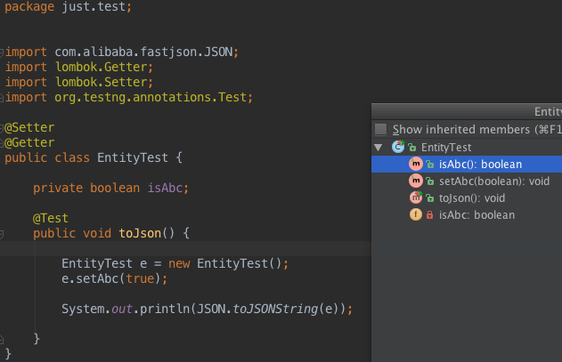
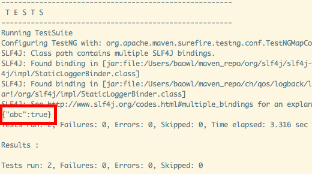

#### 现象
今天有位同学发现一个问题。他在服务端domain object中定义了一个isAuditing字段，而前端同学反馈在服务端接口拿到的字段名是auditing。  

### 为什么字段名对不上了？
这个问题是一个小坑。和Java Bean的规范有关。当boolean字段名为 `isXxx`时，通过lombok生成（用eclipse生成也一样）的Getter方法名是 `isXxx()`，而Setter方法名是`setXxx()`！

处理数据的程序，如果不是通过反射而是通过Getter/Setter来操作字段的话，就会出问题。

#### lombok生成的Getter/Setter方法
下面创建了一个测试类，包含一个boolean字段isAbc，可以看到生成的Getter和Setter方法：

#### Fastjson对此类Bean的序列化
用FastJson对其进行序列化，可见json的key不含is前缀。

综上，boolean字段的命名不要使用is开头。